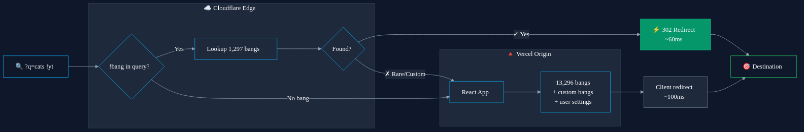

# !ReBang

[](https://bang.kobeerose.workers.dev)
[](https://opensource.org/licenses/MIT)

The fastest web-based bang redirector. Set `https://bang.kobeerose.workers.dev/?q=%s` as your default search engine to use [DuckDuckGo-style bangs](https://duckduckgo.com/bangs) from any browser.


## Why ReBang?

| | DuckDuckGo | unduck | ReBang |
|---|------------|--------|--------|
| **Redirect latency** | 300-600ms | ~120ms | **~60ms** |
| **Approach** | Server-side | Client-side JS | Edge worker |
| **Bang sources** | DDG only | DDG only | DDG + Kagi |
| **Total bangs** | 13,566 | 13,566 | 13,296 unique × 16,190 triggers |
| **Custom bangs** | No | No | Yes |
| **Autocomplete** | Yes | No | Yes |

[unduck](https://github.com/t3dotgg/unduck) by Theo pioneered client-side bang redirects. ReBang takes it further by handling redirects at Cloudflare's edge network: the 302 redirect returns before any HTML or JavaScript loads. This fork serves the frontend from Cloudflare Pages and uses a separate Cloudflare Worker as the public entrypoint.

## How It's Fast

```
User: "cats !yt"  ──►  Cloudflare Edge  ──►  302 redirect to YouTube
                       (nearest PoP)         (~60ms globally)
```

For the top 1,297 bangs, a Cloudflare Worker returns a redirect immediately. No frontend HTML or JavaScript needs to load first. Rare bangs and custom bangs fall through to the Pages-hosted client app.

## Bang Database

ReBang merges bangs from DuckDuckGo and Kagi, deduplicating by URL:

| Source | Count |
|--------|-------|
| DuckDuckGo | 13,566 |
| Kagi | 10,895 |
| Combined (raw) | 24,461 |
| **After deduplication** | **13,296** |

DDG stores each trigger as a separate entry (`!g`, `!google`, `!goog` = 3 entries). ReBang merges these into one bang with multiple triggers. Triggers aren't lost, they're consolidated.

## Features

- **Custom bangs**: Create personal shortcuts stored in localStorage
- **Autocomplete**: Type `!` to search the full database
- **Configurable default**: Set your preferred search engine for queries without a bang
- **Monthly updates**: GitHub Actions fetches fresh bangs from DDG and Kagi

## Setup

Add as your default search engine:

**Chrome:** Settings → Search engine → Manage → Add  
**Firefox:** Visit `bang.kobeerose.workers.dev`, click `+` in address bar  
**URL:** `https://bang.kobeerose.workers.dev/?q=%s`

---

## Architecture



### Edge Worker

```typescript
// Simplified from worker/src/index.ts
export default {
  async fetch(request: Request): Promise<Response> {
    const url = new URL(request.url);
    const query = url.searchParams.get('q');
    
    const bangMatch = query?.match(/!(\S+)/i);
    if (!bangMatch) return passToOrigin(request, env);
    
    const bang = triggerMap.get(bangMatch[1].toLowerCase());
    if (!bang) return passToOrigin(request, env);
    
    const cleanQuery = query.replace(/!\S+\s*/i, '').trim();
    return Response.redirect(bang.u.replace(/%s/g, encodeURIComponent(cleanQuery)), 302);
  },
};
```

### Data Pipeline

```
DuckDuckGo bang.js ──┐
                     ├──► merge + dedupe ──► bangs.json
Kagi bangs.json ─────┘           │
                                 ├──► src/bangs-top.ts (client bundle)
                                 ├──► public/bangs.[hash].json (lazy-loaded full DB)
                                 └──► worker/src/bangs.ts (edge worker)
```

## Development

```bash
pnpm install         # Install frontend dependencies
pnpm run dev         # Start frontend dev server
pnpm run update-bangs # Fetch + merge bangs from sources
pnpm run build       # Production frontend build

cd worker
npm install --no-package-lock  # Worker dependencies  
npx wrangler dev               # Local worker
npx wrangler deploy            # Deploy worker to Cloudflare
```

## Privacy

- **Edge:** Known bangs are resolved by a Cloudflare Worker and redirected without loading the frontend first.
- **Client:** Fallback UI and custom bang handling run in the browser via the Pages-hosted frontend.
- **Settings:** Stored in localStorage, never transmitted.

## Credits

- [unduck](https://github.com/t3dotgg/unduck) by Theo: Original client-side bang redirect
- [Kagi Bangs](https://github.com/kagisearch/bangs): Open-source bang database
- [DuckDuckGo](https://duckduckgo.com/bangs): The original bang search

## License

MIT
